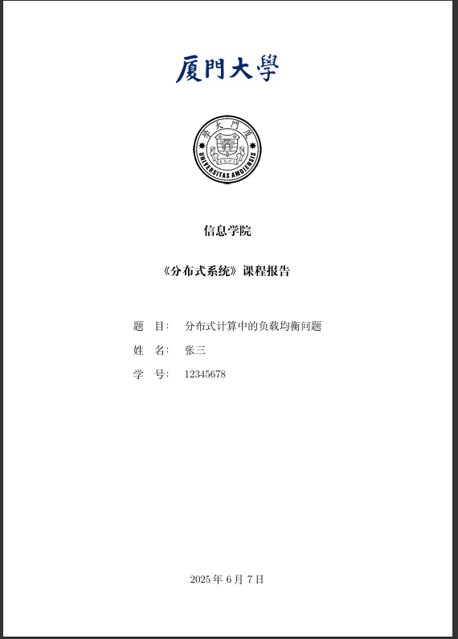

# LaTeX 课程报告模板



这是一个简洁优雅的中文课程报告 LaTeX 模板，适用于大学课程作业、实验报告等学术场景。

## 主要特性

- 📄 标准学术结构：封面、摘要、目录、正文、参考文献
- 🖼️ 专业封面设计：支持校徽/校名图片嵌入
- 📚 开箱即用的中文支持（基于 ctexart）
- 🔢 自动编号的参考文献系统

## 快速开始

1. 克隆本仓库
2. 修改 `main.tex` 中的个人信息：
   ```tex
   \newcommand{\college}{信息学院}
   \newcommand{\coursename}{分布式系统}
   \newcommand{\studentname}{张三}
